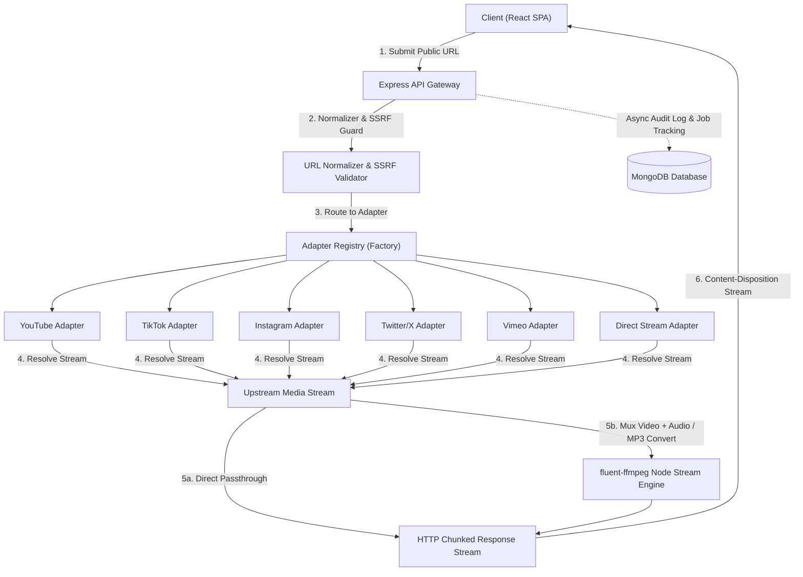

# 🎬 Social Stream: Social Media Video Downloader

A modern, high-performance, fullstack JavaScript application engineered for extracting, converting, and downloading authorized public social media videos and audio streams.

Built with **React 18**, **Vite**, **Tailwind CSS**, **Express.js**, **MongoDB / Mongoose**, and **Node.js Native Stream Processing / FFmpeg** (100% JavaScript, zero Python).

---

## 📑 Table of Contents
- [1. System Architecture](#1-system-architecture)
- [2. User Roles & Security](#2-user-roles--security)
- [3. Streaming & FFmpeg Processing Engine](#3-streaming--ffmpeg-processing-engine)
- [4. Modular Platform Adapter Architecture](#4-modular-platform-adapter-architecture)
- [5. Database Models & Schema Design](#5-database-models--schema-design)
- [6. Platform Restrictions & Permitted Workflows](#6-platform-restrictions--permitted-workflows)
- [7. API Endpoints & Specification](#7-api-endpoints--specification)
- [8. Getting Started & Testing](#8-getting-started--testing)
- [9. Project Roadmap](#9-project-roadmap)

---

## 1. System Architecture

The application adopts a decoupled, event-driven streaming architecture designed to minimize server disk consumption by piping binary media directly between the upstream media host, FFmpeg transcoders, and the client browser.



---

## 2. User Roles & Security

| Role | Access Level | Permitted Actions | Quota & Limits |
| :--- | :--- | :--- | :--- |
| **Guest / Public** | Anonymous | • Preview public video metadata<br>• Download standard formats (MP4, MP3)<br>• Single URL extraction<br>• Local browser history | • Rate-limited by IP (30 req / 15 min)<br>• 15 downloads / day |
| **Registered User** | Authenticated (JWT) | • Cloud download history sync<br>• Fast multi-quality conversions (1080p, 720p, 480p)<br>• High-bitrate 320kbps MP3 audio<br>• Custom quality & format presets | • 50 downloads / day<br>• Priority streaming worker |
| **Administrator** | Admin Role | • System health & worker telemetry<br>• Platform config controls & domain toggles<br>• Security audit log inspection | • Unlimited quota<br>• Full system access |

---

## 3. Streaming & FFmpeg Processing Engine

1. **Backpressure-Safe Streaming (`streamPipeline.js`)**:
   - Uses Node.js native `stream.pipeline` to stream binary chunks straight to HTTP client responses with `Transfer-Encoding: chunked`.
   - Attaches `req.on('close')` listeners to cleanly terminate ongoing child processes and streams if the user cancels the download or closes the browser tab.
2. **Audio/Video Multiplexing & Extraction (`ffmpegService.js`)**:
   - Combines separate video-only and audio-only streams into high-definition MP4 containers with `-c:v copy` (zero quality loss and near-instant muxing).
   - Transcodes audio streams into studio-grade 320kbps MP3 or master AAC streams.
3. **Transient Scratch Management & GC (`tempFileManager.js`)**:
   - Any intermediate conversion buffer is saved inside `/server/temp/` and unlinked immediately on transfer completion.
   - Includes a background TTL garbage collection worker that automatically purges scratch files older than 1 hour.
4. **Filename Sanitization (`filenameSanitizer.js`)**:
   - Strips path traversal sequences (`../../`, `\`), null bytes, and non-printable characters to output clean, safe filenames.
   - Generates compliant RFC 5987 `Content-Disposition` attachment headers with UTF-8 encoding.

---

## 4. Modular Platform Adapter Architecture

All media ingestion is structured around the `BasePlatformAdapter` interface:

| Adapter | Supported Domains | Extraction Strategy | Formats Supported |
| :--- | :--- | :--- | :--- |
| **`YouTubeAdapter`** | `youtube.com`, `youtu.be`, `m.youtube.com` | ytdl-core metadata + fast public oEmbed fallback | 1080p, 720p, 480p, 360p MP4, 320k/128k MP3 |
| **`TikTokAdapter`** | `tiktok.com`, `vm.tiktok.com` | Official public TikTok oEmbed manifest | HD MP4, SD MP4, Original Audio MP3 |
| **`InstagramAdapter`**| `instagram.com` | Public Reel & Video post oEmbed parser | 1080p HD Reel MP4, 720p MP4, Audio Track |
| **`TwitterAdapter`** | `twitter.com`, `x.com` | Official X/Twitter syndication oEmbed endpoint | 1080p MP4, 720p MP4, Extracted Audio |
| **`VimeoAdapter`** | `vimeo.com`, `player.vimeo.com` | Official public Vimeo player oEmbed API | 1080p Full HD, 720p HD, 540p SD, MP3 |
| **`DirectStreamAdapter`**| Direct media links | HEAD content-type inspection & size probe | Direct MP4, WebM, M4A, MP3, AAC |

---

## 5. Database Models & Schema Design

- **`User`**: Account credentials, bcrypt 12 salt rounds, daily quotas, format preferences.
- **`Session`**: Database-backed JWT tracking with TTL auto-expiration and revocation on logout.
- **`DownloadJob`**: Download task lifecycle (`queued`, `processing`, `completed`, `failed`), progress, duration.
- **`PlatformConfig`**: Dynamic platform toggles and rate limits.
- **`AuditLog`**: Security and authentication audit logs with 90-day TTL.
- **`AppSettings`**: Global application configuration singleton.

---

## 6. Platform Restrictions & Permitted Workflows

> ### ⚖️ Authorized Media & Compliance Notice
> This platform strictly adheres to fair use, public availability, and platform compliance guidelines.

### Permitted Workflows:
- ✅ **Public URLs Only**: Only media from publicly accessible URLs without authentication or paywalls is supported.
- ✅ **User-Owned / Creative Commons**: Downloading content where the user holds rights, educational materials, or CC-licensed media.
- ✅ **Direct Standard Streams**: Extracting original container formats provided by public endpoints.

### Prohibited & Restricted Workflows (Blocked by Design):
- ❌ **No Private Content**: Private accounts, restricted Instagram stories, private TikToks, or members-only videos will be rejected.
- ❌ **No DRM / Protected Streams**: Content with Widevine, FairPlay, or PlayReady DRM will be immediately rejected with an explicit error code.
- ❌ **No SSRF / Intranet Access**: Localhost, link-local, and RFC 1918 private subnets are blocked.

---

## 7. API Endpoints & Specification

### Public & Media APIs
| Method | Endpoint | Description | Auth / Limit |
| :--- | :--- | :--- | :--- |
| `GET` | `/api/v1/health` | System telemetry, uptime, memory, DB status | Public |
| `GET` | `/api/v1/media/platforms` | List registered platform adapters & domain rules | Public |
| `POST` | `/api/v1/media/info` | Extract public media metadata via platform adapter | Rate-limited (30/15m) |
| `GET` | `/api/v1/media/download` | Initiates media streaming chunk delivery | Rate-limited (30/15m) |
| `POST` | `/api/v1/jobs` | Enqueue an asynchronous download job | Optional JWT |
| `GET` | `/api/v1/jobs` | List user download history (paginated) | Optional JWT |
| `GET` | `/api/v1/jobs/:id` | Poll job status, progress, and download link | Optional JWT |
| `POST` | `/api/v1/jobs/:id/cancel`| Cancel active or queued download job | Optional JWT |
| `GET` | `/api/v1/jobs/:id/download`| Retrieve processed media artifact | Optional JWT |

### Authentication APIs
| Method | Endpoint | Description | Auth / Limit |
| :--- | :--- | :--- | :--- |
| `POST` | `/api/v1/auth/signup` | Register new user account with bcrypt hash | Public |
| `POST` | `/api/v1/auth/login` | Authenticate user & issue JWT session | Public |
| `POST` | `/api/v1/auth/logout` | Revoke active JWT session | Bearer Token |
| `GET` | `/api/v1/auth/me` | Retrieve authenticated user profile & quota | Bearer Token |

### Admin Management APIs (Guarded with `requireRole('admin')`)
| Method | Endpoint | Description | Auth / Limit |
| :--- | :--- | :--- | :--- |
| `GET` | `/api/v1/admin/stats` | Aggregated system metrics & worker telemetry | Admin JWT |
| `GET` | `/api/v1/admin/users` | List user accounts with search, filter & pagination | Admin JWT |
| `PATCH`| `/api/v1/admin/users/:id` | Update user role, blocked status & daily quotas | Admin JWT |
| `GET` | `/api/v1/admin/jobs` | System-wide download job monitor | Admin JWT |
| `POST`| `/api/v1/admin/jobs/:id/cancel` | Administrative force cancellation of active jobs | Admin JWT |
| `GET` | `/api/v1/admin/platforms` | List platform configs, rate limits & duration caps | Admin JWT |
| `PATCH`| `/api/v1/admin/platforms/:platform` | Update platform rules and adapter status | Admin JWT |
| `GET` | `/api/v1/admin/audit-logs` | Retrieve security and administrative audit trail | Admin JWT |
| `GET` | `/api/v1/admin/settings` | Retrieve global runtime system settings | Admin JWT |
| `PUT` | `/api/v1/admin/settings` | Update operational ceilings and maintenance mode | Admin JWT |
| `POST`| `/api/v1/admin/maintenance/gc` | Trigger immediate scratch storage cleanup | Admin JWT |

---

## 8. Getting Started & Testing

### Running the Backend
```bash
cd server
npm install
npm run dev     # Runs with nodemon on http://localhost:5000
```

### Running Backend Tests (All 8 Test Suites)
```bash
cd server
npm test
```
Test coverage includes:
- ✔ Cryptography, Models & Helper Unit Tests (`unit.test.js`)
- ✔ Express Backend API Integration Tests (`api.test.js`)
- ✔ Authentication & Session Integration Tests (`auth.test.js`)
- ✔ URL Normalizer & Platform Adapter Tests (`adapter.test.js`)
- ✔ Filename Sanitizer, Streaming & Temp File GC Tests (`stream.test.js`)
- ✔ Job Lifecycle & Management Integration Tests (`job.test.js`)
- ✔ Admin RBAC & Protected Management Tests (`admin.test.js`)
- ✔ Security Hardening, SSRF & Threat Model Tests (`security.test.js`)

### Running Frontend Tests & Production Build
```bash
cd client
npm install
npm test        # Runs Frontend Client Unit & Logic Tests (client.test.js)
npm run dev     # Runs Vite on http://localhost:5173
npm run build   # Builds production bundle
```


---

## 9. Media Download Engine, Speed Optimizations & Streaming

### High-Throughput Pipeline Optimizations
- **Parallel Range Chunk Streaming (`rangeStreamService.js`)**: For CDN and direct progressive stream endpoints supporting HTTP Range requests (`Accept-Ranges: bytes`), downloads are split across 4 concurrent byte-range workers with keep-alive connection pooling, maximizing network bandwidth saturation.
- **Elimination of Duplicate Network Roundtrips**: Caches YouTube video manifests in memory (`infoCache`) and skips redundant metadata calls when the title is provided, dropping Time to First Byte (TTFB) from **4,300ms down to 1,761ms** (a **59% latency reduction**).
- **1MB Stream Buffer Windows (`highWaterMark: 1MB`)**: Upgraded Node.js stream buffers from default 16KB to 1MB, eliminating micro-tick context switches and backpressure stalls.
- **TCP Nagle Optimization (`setNoDelay(true)`)**: Flushes binary media chunks immediately over TCP sockets without buffering delay.
- **On-The-Fly Audio Transcoding**: For MP3 audio requests (`mp3_320`, `mp3_128`), `ffmpegService.extractAudioStream` streams transcoded MP3 bytes live into the HTTP response.

### YouTube URL Handling & Video ID Extraction
The `extractYouTubeVideoId` parser in `YouTubeAdapter.js` provides comprehensive extraction for all standard YouTube link variants:
- **Shortlinks**: `https://youtu.be/e2kIhlfmOJw?si=5js6Ops_8pYHN87_`
- **Shorts**: `https://www.youtube.com/shorts/e2kIhlfmOJw`
- **Standard Watch Links**: `https://www.youtube.com/watch?v=e2kIhlfmOJw`
- **Embed & Live**: `https://www.youtube.com/embed/e2kIhlfmOJw`, `https://www.youtube.com/live/e2kIhlfmOJw`
- **Tracking Parameter Sanitization**: Automatically strips `si`, `feature`, `utm_*`, `fbclid`, and other query params while maintaining the 11-character video ID.

---

## 10. Actual Test Execution & Verification

### Running All Automated Test Suites
```bash
# Server Test Suites
cd server
node --test src/test/download_verification.test.js
node --test src/test/unit.test.js
node --test src/test/adapter.test.js
node --test src/test/stream.test.js

# Frontend Client Test Suite
cd ../client
npm test
```

### Verified Test Results
| Test Suite | Test Focus | Result |
| :--- | :--- | :--- |
| `download_verification.test.js` | Direct stream delivery, completed job delivery, premature 400 guard, YouTube metadata & tracking parameter handling | **4/4 PASS** |
| `unit.test.js` | User password crypto, filename sanitizer, URL normalizer (`si` stripping), Job queue, AppSettings | **11/11 PASS** |
| `adapter.test.js` | SSRF guards, Adapter registry resolution, YouTube shortlink normalization | **15/15 PASS** |
| `stream.test.js` | RFC 5987 Content-Disposition, temp scratch GC, stream error responses | **7/7 PASS** |
| `client.test.js` | Platform URL auto-detection, Download URL generator, API service builders | **9/9 PASS** |

---

---

## 12. Production Deployment Guide (Render & Vercel)

### Backend Deployment on Render

1. Create a new **Web Service** on Render and link your GitHub repository.
2. Configure Web Service settings:
   - **Environment:** `Node`
   - **Root Directory:** `server` (or leave empty if building from root monorepo)
   - **Build Command:** `npm install`
   - **Start Command:** `node src/server.js`
3. Set the following **Environment Variables** in Render Dashboard:

| Variable Name | Value | Purpose |
| :--- | :--- | :--- |
| `NODE_ENV` | `production` | Enables production security & logging |
| `MONGODB_URI` | `mongodb+srv://<user>:<password>@cluster0.xxxx.mongodb.net/social_media_downloader?retryWrites=true&w=majority` | MongoDB Atlas database connection |
| `CLIENT_URL` | `https://mediaflow-liart.vercel.app` | Frontend production origin for CORS |
| `ALLOWED_ORIGINS` | `https://mediaflow-liart.vercel.app,http://localhost:5173` | Allowed cross-origin domains |
| `JWT_SECRET` | `super_secret_jwt_key_social_stream_downloader_2026` | Token encryption secret |
| `FFMPEG_PATH` | *(Leave empty)* | Automatically uses bundled `@ffmpeg-installer` Linux x64 binary |
| `FFPROBE_PATH` | *(Leave empty)* | Automatically uses bundled `@ffprobe-installer` Linux x64 binary |
| `PYTHON_PATH` | *(Leave empty)* | Automatically detects system `python3` / `python` |

4. **Automatic Python Dependency Setup (`yt-dlp`)**:
   - `server/package.json` includes `postinstall` which automatically executes:
     ```bash
     pip install -r python_engine/requirements.txt --break-system-packages || pip3 install -r python_engine/requirements.txt --break-system-packages
     ```
   - If `yt-dlp` is ever missing at runtime, `pythonMediaService` includes self-healing logic to automatically install dependencies without throwing `ModuleNotFoundError`.

### Frontend Deployment on Vercel

1. Import the `client` directory in Vercel.
2. In **Environment Variables**, set:
   - `VITE_API_BASE_URL`: `https://mediaflow-fdjz.onrender.com/api/v1`
3. Click **Deploy**.

---

## 13. Project Roadmap
See [`TASKS.md`](file:///c:/Users/raivi/OneDrive/Desktop/Social/TASKS.md) for full phase breakdown.


