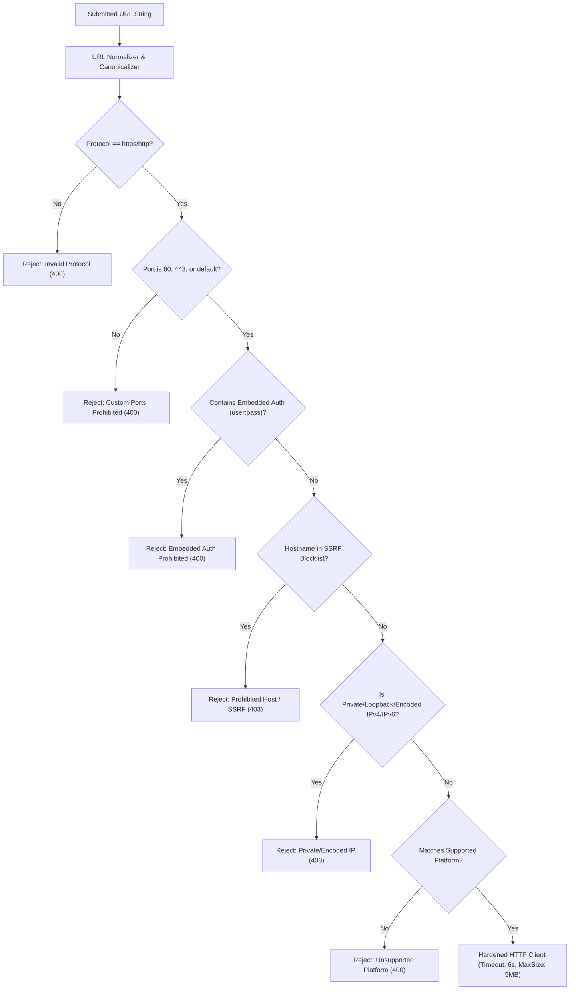

# 🛡️ Security Policy & Architecture Guide (SECURITY.md)

This document details the security architecture, threat model, SSRF defense mechanisms, input sanitization policies, operational mitigations, and remaining limitations for **SocialStream**.

---

## 1. Threat Model & Permitted Media Policy

SocialStream is engineered as an authorized media retrieval gateway. It operates under strict fair-use, public availability, and user consent parameters.

### Permitted Media Ingestion:
- ✅ **Public URLs**: Media distributed openly on supported platforms without login barriers or paywalls.
- ✅ **Canonical Hosts**: Requests routed exclusively through allowlisted platform domains.
- ✅ **User-Owned / CC Media**: Content for personal backups, research, and educational fair use.

### Prohibited Operations (Blocked by Design):
- ❌ **No Private or Restricted Accounts**: Private Instagram profiles, locked TikTok accounts, and members-only streams are rejected with `PRIVATE_MEDIA_RESTRICTED`.
- ❌ **No DRM Encrypted Streams**: Media protected by Widevine, FairPlay, or PlayReady DRM is rejected with `DRM_PROTECTED`.
- ❌ **No Internal / Intranet Access**: Any request resolving to internal network infrastructure is rejected with `PRIVATE_MEDIA_RESTRICTED`.

---

## 2. Multi-Layer SSRF Defense Architecture

To protect server environments from Server-Side Request Forgery (SSRF), all submitted URLs pass through multi-tiered validation before any network connection is initiated.

### Prohibited & Blocked Destinations:
1. **Loopback & Localhost**:
   - `127.0.0.0/8`, `0.0.0.0/8`, `localhost`, `[::1]`, `0:0:0:0:0:0:0:1`
2. **RFC 1918 Private Subnets**:
   - `10.0.0.0/8` (`10.0.0.0` - `10.255.255.255`)
   - `172.16.0.0/12` (`172.16.0.0` - `172.31.255.255`)
   - `192.168.0.0/16` (`192.168.0.0` - `192.255.255.255`)
3. **Link-Local & Cloud Metadata Endpoints**:
   - `169.254.0.0/16` (`169.254.169.254` AWS/GCP/Azure instance metadata)
   - `metadata.google.internal`, `instance-data`
4. **IPv6 Unique Local & Link-Local**:
   - `fc00::/7` (Unique Local Addresses)
   - `fe80::/10` (Link-Local Addresses)
5. **Alternative IP Encodings**:
   - Hex (`0x7f000001`), Decimal Dword (`2130706433`), Octal (`0177.0.0.1`), and leading-zero octets (`127.000.000.001`).

---

## 3. Safe HTTP Client & Redirect Controls (`safeHttpClient.js`)

All outbound metadata and stream probes use a hardened HTTP client:
- **Request Timeout**: Maximum 6,000 ms.
- **Redirect Limits**: Maximum 3 hops; every redirect target is validated against SSRF rules before following.
- **Payload Size Cap**: Maximum 5 MB for manifest and oEmbed responses.
- **Safe User-Agent**: Identifies requests transparently as `SocialStreamBot/1.0`.

---

## 4. Rate Limiting & Abuse Prevention Matrix

| Tier | Window | Limit | Target Endpoints | Purpose |
| :--- | :--- | :--- | :--- | :--- |
| **Auth Tier** | 15 minutes | 15 req / IP | `/api/v1/auth/signup`, `/api/v1/auth/login` | Prevent brute-force & credential stuffing |
| **Media Tier** | 10 minutes | 30 req / IP | `/api/v1/media/info`, `/api/v1/media/download` | Prevent upstream scraping abuse |
| **General API**| 15 minutes | 60 req / IP | All `/api/v1/*` endpoints | Protect overall server throughput |

---

## 5. Media Processing & Command Injection Defense

1. **Zero Shell Interpolation (`ffmpegService.js`)**:
   - FFmpeg is invoked exclusively via `fluent-ffmpeg` as an isolated child process with argument arrays. No user strings are passed to shell evaluators (`sh`, `bash`, `cmd.exe`).
   - Output format and bitrate options are strictly validated against allowlists (`['mp3', 'm4a', 'aac', 'mp4', 'webm']`, `['320k', '256k', '192k', '128k', '96k', '64k']`).
2. **Filename Traversal & Header Injection (`filenameSanitizer.js`)**:
   - Strips directory traversal sequences (`../`, `..\`), path separators, control characters (`\x00-\x1f`), and invalid characters.
   - Enforces RFC 5987 `Content-Disposition: attachment; filename=...; filename*=UTF-8''...` encoding.
3. **Scratch Storage Hygiene (`tempFileManager.js`)**:
   - Random unguessable filenames (`stream_<timestamp>_<randomHex>.tmp`).
   - Immediate asynchronous unlinking upon stream finish, client abort, or error.
   - Background TTL garbage collection worker purges files older than 1 hour.

---

## 6. Authentication, Session & Data Protection

- **Password Security**: Hashed using `bcryptjs` with 12 salt rounds. Password strength requires at least 8 characters, with both letters and numbers.
- **Session Revocation**: JWT tokens are backed by MongoDB `Session` records with immediate revocation on logout or user deactivation.
- **Data Minimization**: Passwords (`passwordHash`) are excluded by default via Mongoose schema projection (`select: false`) and are never exposed in user or admin responses.
- **Audit Logging**: Sensitive actions (logins, cancellations, role changes, settings updates) are recorded with IP, user-agent, and status.

---

## 7. Remaining Limitations & Residual Risks

> [!WARNING]
> While extensive defenses are implemented, the following residual risks inherent to web media ingestion remain:
> 1. **DNS Rebinding**: In environments without split-horizon internal DNS resolvers, a hostile domain could respond with a public IP during initial validation and resolve to an internal IP upon socket connection. *Mitigation: Deploy behind an egress proxy or configure internal DNS firewalls.*
> 2. **Upstream Platform Changes**: Third-party social media providers frequently modify their public oEmbed APIs and CDN streaming formats, which can temporarily disrupt media extraction.
> 3. **Upstream IP Rate Limiting**: Heavy concurrent downloading from shared hosting IPs may trigger upstream CDN rate limits (e.g. HTTP 429 from YouTube or TikTok).

---

## 8. Vulnerability Disclosure Policy

If you discover a security vulnerability, please report it responsibly:
- **Email**: `security@socialstream.dev`
- Please include reproduction steps, payload details, and expected vs actual behavior.
- Reports will be acknowledged within 48 hours.
